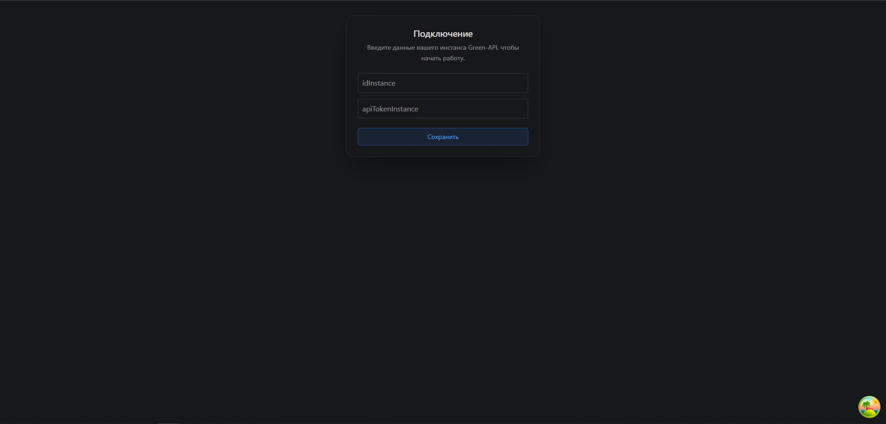
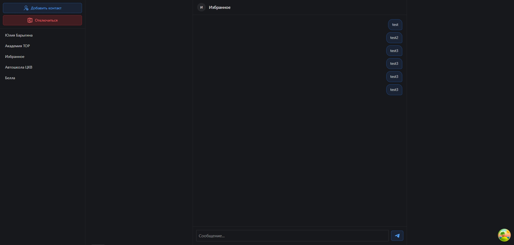
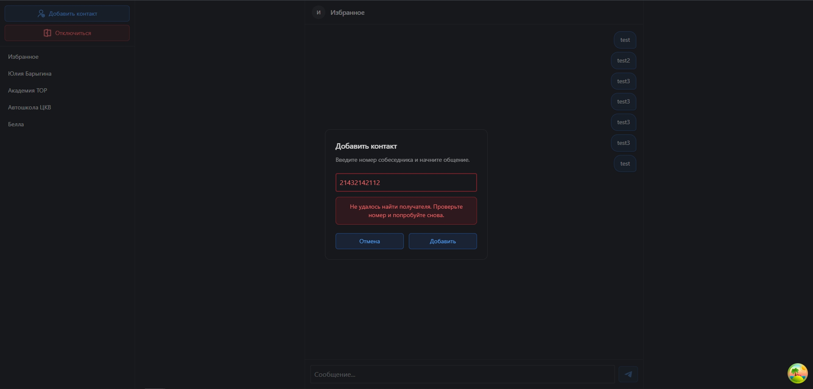
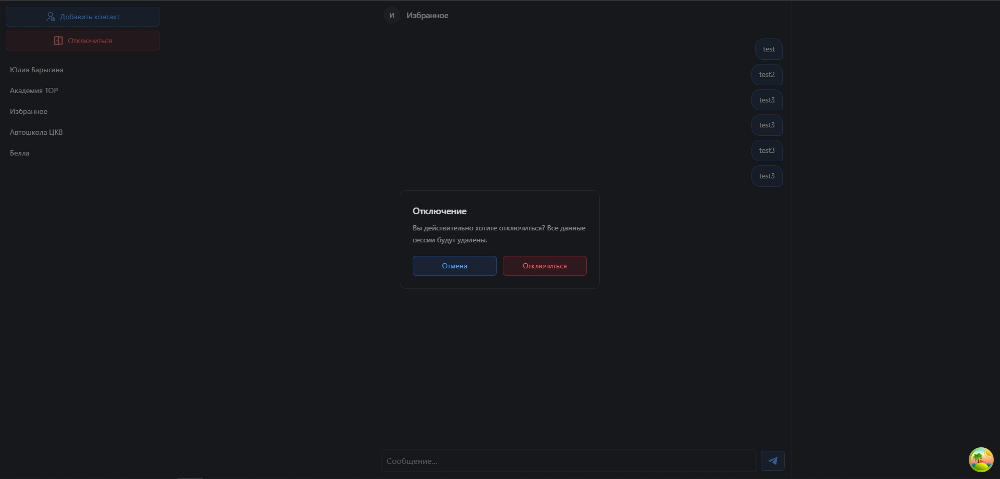

## Реализовано
- Отправка и получение текстовых сообщений
- Получение чатов
- Подключение через idInstance и apiTokenInstance
- Интерфейс похож на интерфейс мессенджера MAX

# Превью
 




## Технологии
- TypeScript + React
- Tailwind CSS
- Tanstack Query

## Установка
```bash
# Клонирование
git clone https://github.com/SergeyDultsev/green-api-chat.git

# Создать .env
copy .env.example .env

# Установка пакетов
npm i

# Запуск сервера
npm run dev
```

## Источники
- [GREEN-API](https://green-api.com/max)